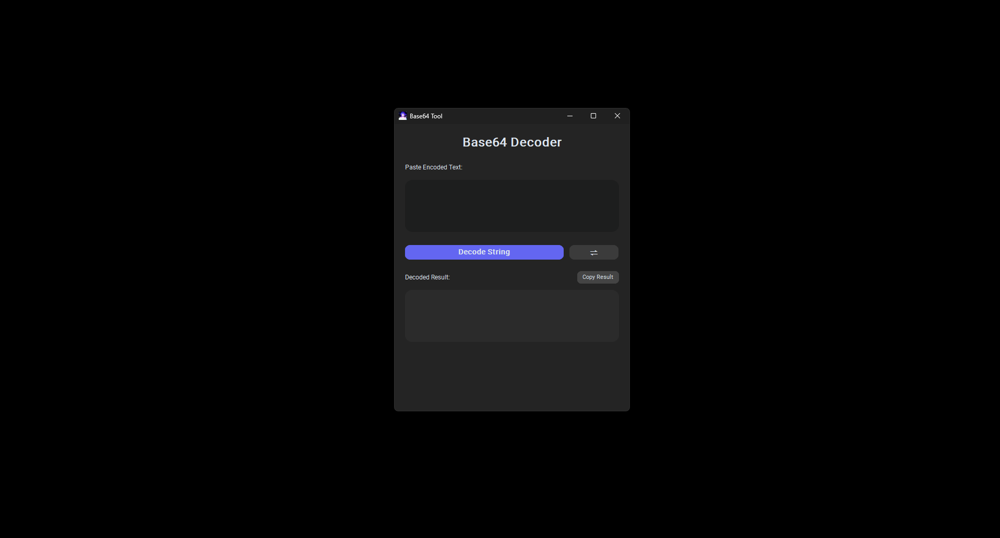

# Simple Python Base64 Decoder/Encoder.

I got tired of using online converters just to decode a simple string. It's a clean, small desktop app that does one thing and does it well.



## What it does
* **Encodes & Decodes:** Swaps between modes with one click.
* **Clipboard Button:** Copies the result instantly.
* **Standalone:** Runs as a single `.exe` file.

## How to use it
**Option 1:** Download `decoder.exe` from the Releases tab and run it.

**Option 2:** Run the script yourself:

**Requirements**

* **Python** (3.10 or newer)
* `customtkinter` (for the UI)
* `pyperclip` (for the copy button)
* `pyinstaller` (only if you want to build the .exe yourself)

You can install the libraries with one command:
```bash
pip install customtkinter pyperclip pyinstaller
